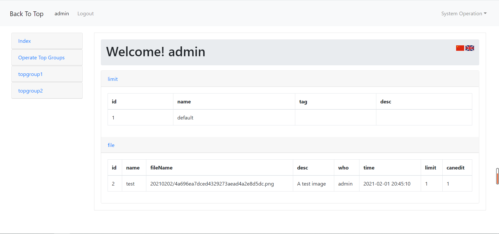
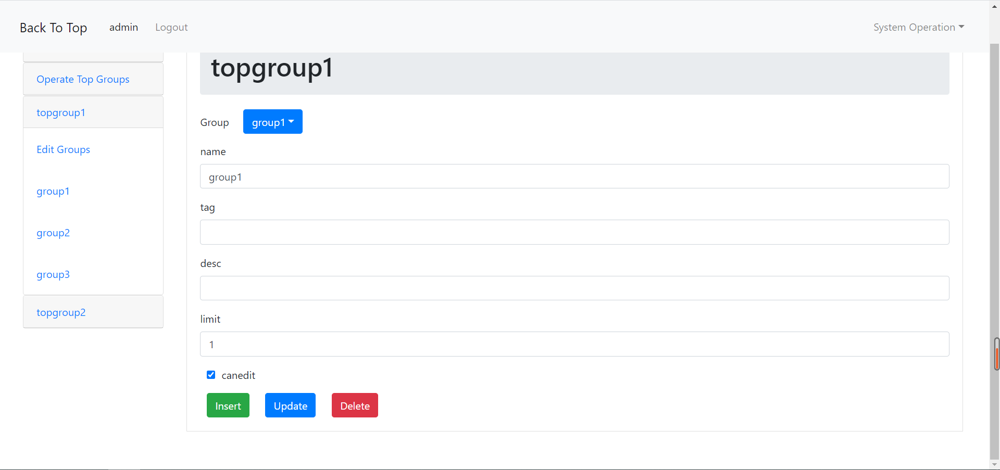
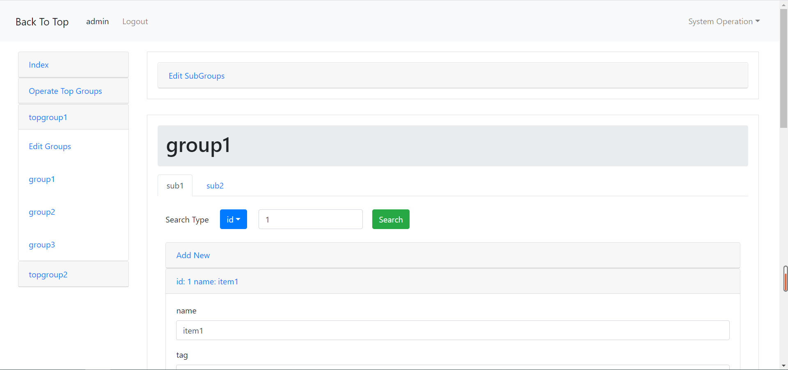
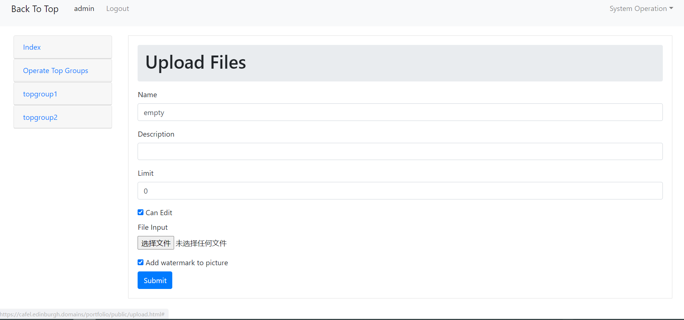

# Portfolio
A personal Portfolio project.  
This is the data management system, focusing on storing and editing data. 
Different users have different priorities。 
<b>Name:</b> admin  <b>Password:</b> password   &nbsp;&nbsp;&nbsp;&nbsp;&nbsp;&nbsp;&nbsp;&nbsp;&nbsp;&nbsp;&nbsp;&nbsp;  to login as the main administrator 
<b>Name:</b> guest  <b>Password:</b> guest  &nbsp;&nbsp;&nbsp;&nbsp;&nbsp;&nbsp;&nbsp;&nbsp;&nbsp;&nbsp;&nbsp;&nbsp;  to login as a guest 
<a href="https://cafel.edinburgh.domains/portfolio/public/admin"><b>Click here to visit</b></a> 

Besides, another project, a web game made by Cocos Creator is here.  
<a href="https://github.com/cafel176/CanvasBall"><b>Click here to visit</b></a> 

 
I mainly use jquery and bootstrap to build the HTML web page. 
Use HTML, CSS, javascript in these pages. 

 
 
For the server, I mainly use thinkphp5 to build it. 
PHP is used to handle the post and get a request from HTML. 
I also use MySQL to store the data from HTML, and users can also use a web page to edit the data.  

 
 
Besides, it also provides a page to upload a file and save it on the server. 
If this file is an image, you can choose to add watermark for it. 

